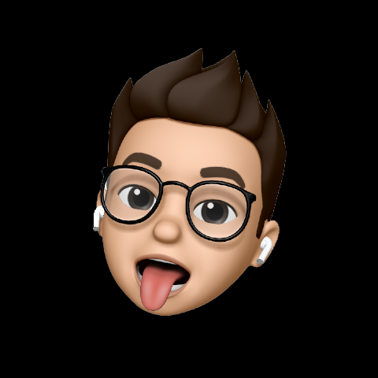

## Hi, I'm Redentic 👋
I'm a French tweaks developer who started contributing to the community in [March 2020](https://github.com/RedenticDev/SBColors). I really love programming & had skills in Java, C and many more. Jailbroken since iOS 11 and enjoying tweaks, I thought, "why not starting developing them?", and **here I am**.

### 🙌 My contribution to the community
I've only done, I only do and will only do *free tweaks*, because I think the community deserves it, and I've only been well received so far. I'm totally open-minded, so don't hesitate to: fork and PR my tweaks, send me suggestions, report bugs & issues, or simply talk with me through my social medias :)

### 📖 Languages I've practiced
Java, C, Objective-C (& Logos), HTML, CSS, JS, Swift (not that much), Shell (Bash & Batch), JSON, Python (G.O.A.T), Kotlin, SQL & R (hate this).

### 💻 Repo & social media
**My repo : [redentic.dev](https://redentic.dev)** *(aka [redenticdev.github.io](https://github.com/RedenticDev/redenticdev.github.io))*  
I'm available on [Twitter](https://twitter.com/RedenticDev), [Reddit](https://www.reddit.com/user/redentic), [GitHub](https://github.com/RedenticDev), [Paypal](https://www.paypal.me/redenticdev) & [Mail](mailto:redenticdev@gmail.com).
